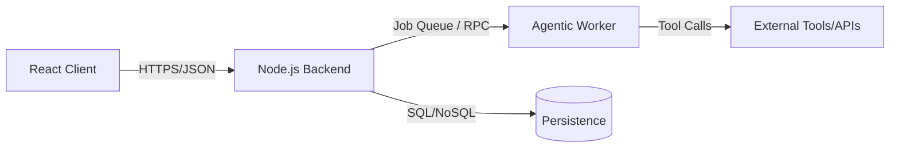
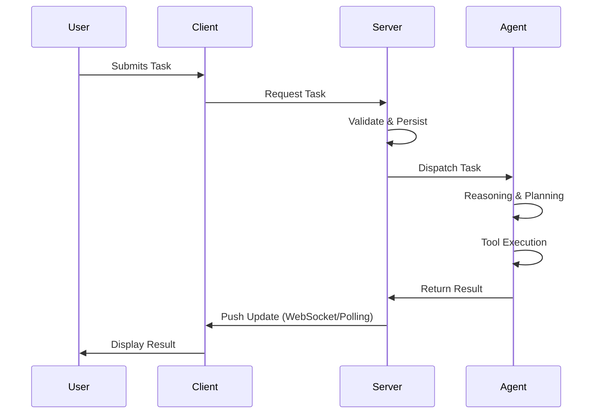

```text
# Related Code
- `server/`
- `agent/`
- `client/`
- `presentation/`
```

# Architecture Overview

The PFE Project is built on a **Distributed Micro-Service Architecture** (loosely coupled via API and message passing) designed to separate user interaction from heavy-duty agentic processing.

## Architectural Summary

- **Frontend (Client)**: A React-based SPA that handles state management and user input.
- **Backend (Server)**: A Node.js/Express core that manages authentication, routing, and orchestrates calls to the Agent.
- **Agent Layer**: A Python/TypeScript hybrid system that performs autonomous reasoning, tool usage, and long-running tasks.
- **Presentation Layer**: Shared UI components and assets to ensure a consistent look and feel across different application modules.

## Component Diagram



## Data Flow



## Deployment Topology

In a production environment, the components are deployed as follows:
- **Client**: Hosted on a CDN (e.g., Vercel, Cloudflare Pages).
- **Server**: Containerized (Docker) and deployed on a cloud provider (AWS/GCP).
- **Agent**: Scalable worker nodes (K8s) capable of horizontal scaling based on queue depth.

## Technical Debt & Trade-offs

- **Sync vs Async**: Currently, some agent calls are handled synchronously, which may lead to timeout issues during heavy reasoning. Transitioning to a fully event-driven architecture (using RabbitMQ or Redis Streams) is a priority.
- **Shared State**: The `presentation` layer is currently semi-coupled with the `client`. Moving towards a more strict Design System library is recommended.
