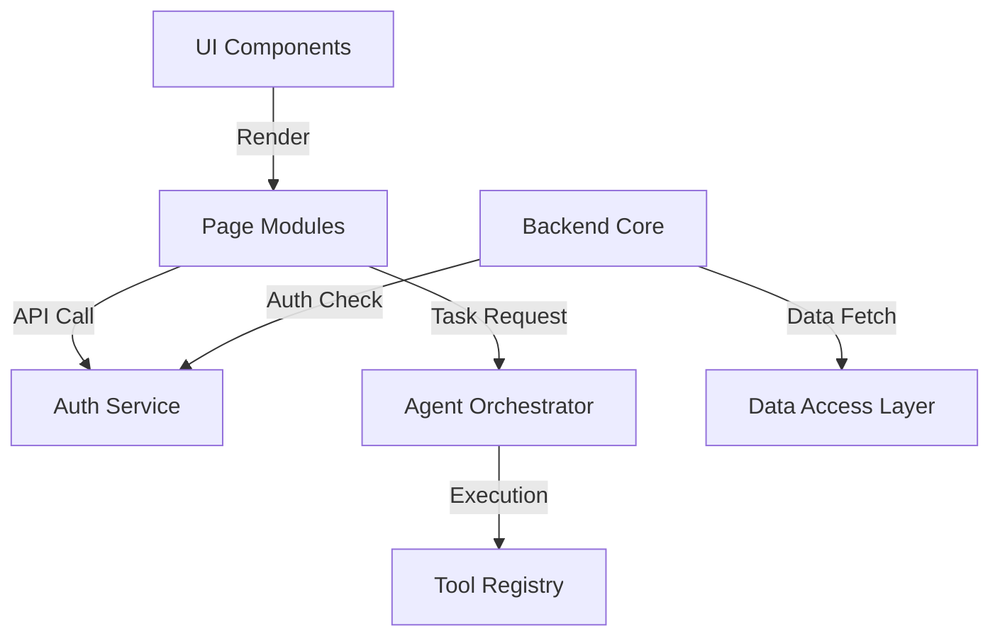

```text
# Related Code
- `client/src/components`
- `server/src/services`
- `agent/src/tools`
```

# Core Components Overview

This project is composed of several modular components that handle specific responsibilities.

## Component Dictionary

| Component | Responsibility | Key Files |
| :--- | :--- | :--- |
| **UI Components** | Reusable React elements (Buttons, Modals, Tables) | `client/src/components/*` |
| **Auth Service** | JWT generation, login/logout, session management | `server/src/services/auth.ts` |
| **Agent Orchestrator** | Decodes user intent into agent tasks | `agent/src/main.ts` |
| **Tool Registry** | Definitions for external API calls/functions | `agent/src/tools/*` |
| **Data Access Layer** | DB queries and model interactions | `server/src/models/*` |

## Relationship Graph



## Critical Paths

1.  **Task Submission Flow**:
    `Client UI` -> `Server API` -> `Auth Check` -> `Job Persistence` -> `Agent Orchestrator` -> `Task Queue` -> `Agent Worker`.
2.  **Real-time Updates**:
    `Agent Worker` -> `Result Persistence` -> `WebSocket/Polling` -> `Client UI Update`.
