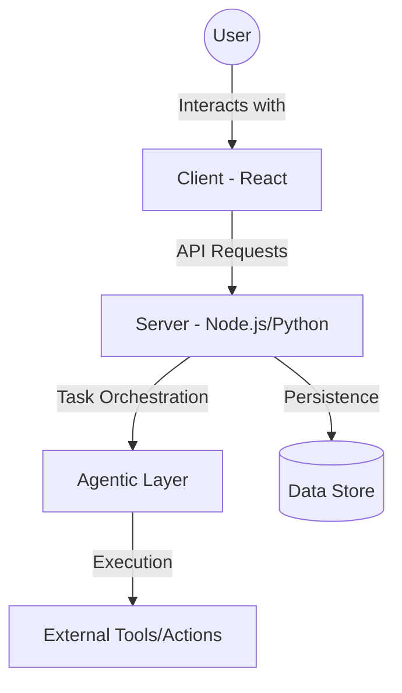

```text
# Related Code
- `client/`
- `server/`
- `agent/`
- `presentation/`
```

# Project Overview

A comprehensive application designed to integrate agentic workflows with a robust frontend and backend architecture. The project serves as a platform for complex task automation, featuring a multi-layered approach to handle user interactions, data processing, and agent-driven execution.

## Tech Stack Radar

| Layer | Technology |
| :--- | :--- |
| **Frontend** | React, TypeScript, Vite |
| **Backend** | Node.js, Python |
| **Agentic Framework** | Custom Agent Implementation |
| **Infrastructure** | Localhost / Development Environment |

## System Context



## Architectural Highlights

1. **Decoupled Agent Logic**: The `agent` directory encapsulates complex decision-making logic, allowing for independent scaling and iteration of agentic behaviors.
2. **Multi-Language Backend**: Leveraging both Node.js for real-time I/O and Python for specialized processing (e.g., ML, data manipulation).
3. **Componentized Frontend**: A structured React application in the `client` directory ensures a modular UI that can adapt to various user needs.

## Known Risks & Technical Debt

1. **Concurrency Management**: Handling multiple simultaneous agent tasks within the Node.js event loop requires careful management of async operations.
2. **Data Synchronization**: Ensuring consistency between the Python-driven data processing and the primary database requires robust message passing.

## Design Rationale

This architecture was chosen to provide maximum flexibility. By separating the "Agent" from the "Server", we can swap out the execution engine (e.g., from a custom Python script to a larger framework like LangChain or Autogen) without re-architecting the entire user-facing API or the frontend.
